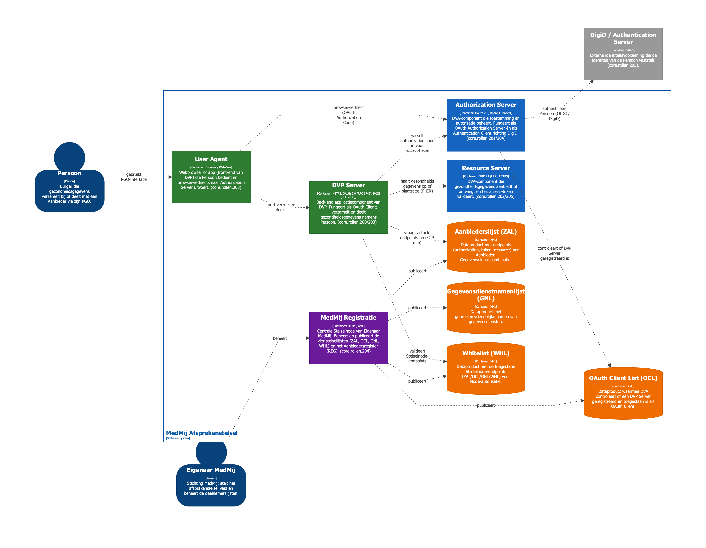

# MedMij Publicatie

Documentatiepublicatie van het MedMij Afsprakenstelsel. De objecten worden beheerd als RDF/Turtle-bestanden en automatisch gepubliceerd als documentatiesite via GitHub Pages.

**Site:** https://afsprakenstelsel.github.io/publicatie/

---

## C4-architectuur – MedMij Afsprakenstelsel

> Structurizr-bronbestand: [`architecture/medmij.dsl`](architecture/medmij.dsl)

### Level 2 – Containers



---

## C4-architectuur – GitHub Pages publicatiepipeline

> Structurizr-bronbestand: [`architecture/github-pages.dsl`](architecture/github-pages.dsl)

### Level 2 – Containers

```structurizr
workspace "MedMij Publicatie" "GitHub Pages publicatiepipeline – C4 Level 2" {

    model {

        !identifiers hierarchical

        redacteur = person "Redacteur" {
            description "Beheert TTL-objectbestanden lokaal en pusht wijzigingen naar GitHub."
        }

        lezer = person "Lezer" {
            description "Raadpleegt de gepubliceerde documentatiesite via een browser."
        }

        publicatie = softwareSystem "MedMij Publicatie" {
            description "Automatische publicatiepipeline van RDF-objecten naar een statische documentatiesite op GitHub Pages."

            repo = container "GitHub Repository (main)" {
                description "Bevat alle TTL-objectbestanden, het generatiescript, de MkDocs-configuratie en de GitHub Actions workflow."
                technology "Git / GitHub"
                tags "Storage"
            }

            actions = container "GitHub Actions Runner" {
                description "Voert de deploy-workflow uit na iedere push naar main."
                technology "ubuntu-latest, Python 3, pip"
                tags "CI"
            }

            generateScript = container "generate_docs.py" {
                description "Parseert alle TTL-bestanden per objectmap met rdflib en genereert HTML-tabellen."
                technology "Python, rdflib"
                tags "Script"
            }

            mkdocs = container "MkDocs (Material)" {
                description "Bouwt een statische HTML-site van de gegenereerde Markdown-pagina's."
                technology "MkDocs, mkdocs-material"
                tags "Script"
            }

            ghPages = container "gh-pages branch" {
                description "Bevat de gebouwde statische HTML-site."
                technology "HTML, CSS, JavaScript"
                tags "Storage"
            }

            cdn = container "GitHub Pages CDN" {
                description "Serveert de statische site publiek via HTTPS."
                technology "GitHub Pages"
                tags "Hosting"
            }
        }

        redacteur -> publicatie.repo          "pusht gewijzigde TTL-bestanden naar main"
        publicatie.repo    -> publicatie.actions        "triggert workflow bij push"
        publicatie.actions -> publicatie.generateScript "voert uit"
        publicatie.generateScript -> publicatie.repo   "leest TTL, schrijft Markdown"
        publicatie.actions -> publicatie.mkdocs         "voert mkdocs gh-deploy uit"
        publicatie.mkdocs  -> publicatie.ghPages        "pusht gebouwde HTML"
        publicatie.ghPages -> publicatie.cdn            "geserveerd door"
        lezer -> publicatie.cdn "raadpleegt documentatiesite"
    }

    views {
        container publicatie "L2-GitHub-Pages" {
            title "MedMij Publicatie – Level 2: GitHub Pages pipeline"
            include *
            autoLayout lr
        }

        styles {
            element "Person"   { shape Person; background #08427b; color #ffffff }
            element "Storage"  { shape Cylinder; background #f5a623; color #000000 }
            element "CI"       { background #e67e22; color #ffffff }
            element "Script"   { background #85bbf0; color #000000 }
            element "Hosting"  { background #27ae60; color #ffffff }
            element "Container"{ background #438dd5; color #ffffff }
        }
    }
}
```

---

## Werkwijze – Een afspraak publiceren

Een afspraak (arrangement) is een verantwoordelijkheid of verplichting waaraan deelnemers zich conformeren. Elke afspraak wordt beheerd als een RDF/Turtle-bestand en bij iedere wijziging automatisch gepubliceerd.

### 1. Maak of wijzig een TTL-bestand

Elk object staat in `objecten/<type>/<naam>.ttl`. Voor een afspraak is de map `objecten/arrangements/`.

De bestandsstructuur volgt het patroon van `core.rollen.206`:

```turtle
@prefix rdf:    <http://www.w3.org/1999/02/22-rdf-syntax-ns#> .
@prefix rdfs:   <http://www.w3.org/2000/01/rdf-schema#> .
@prefix xsd:    <http://www.w3.org/2001/XMLSchema#> .
@prefix medmij: <https://register.medmij.nl/ontology/> .
@prefix obj:    <https://register.medmij.nl/objects/> .

obj:<slug>
    a medmij:Object, medmij:Arrangement ;
    medmij:elementName "<naam van de afspraak>" ;
    medmij:code "<code, bijv. core.rollen.206>" ;
    medmij:objectClass medmij:Arrangement ;
    medmij:layer "<Business | Applicatie | Technologie>" ;
    medmij:mappingNote "<korte toelichting, max één zin>" ;
    medmij:arrangementText "<volledige tekst van de verantwoordelijkheid>" ;
    medmij:toelichting "<optionele nadere uitleg, zichtbaar als inklapbare sectie>" ;
    medmij:sourceUrl <https://afsprakenstelsel.medmij.nl/...> .
```

**Verplichte velden:** `elementName`, `code`, `objectClass`, `layer`, `mappingNote`  
**Optioneel voor afspraken:** `arrangementText`, `toelichting`, `sourceUrl`

De `layer` bepaalt de rijkleur in de gepubliceerde tabel:

| Waarde | Kleur |
|--------|-------|
| `Business` | geel (`#fffae6`) |
| `Applicatie` | cyaan (`#e6fcff`) |
| `Technologie` | groen (`#e3fcef`) |

### 2. Commit en push naar `main`

```bash
git add objecten/arrangements/<naam>.ttl
git commit -m "Voeg afspraak <code> toe: <korte omschrijving>"
git push
```

### 3. Automatische publicatie (GitHub Actions)

Na iedere push naar `main` voert de workflow `.github/workflows/deploy.yml` automatisch de volgende stappen uit:

```
push naar main
    └── GitHub Actions
            ├── pip install (mkdocs-material, rdflib)
            ├── python scripts/generate_docs.py
            │       └── parseert alle TTL-bestanden met rdflib
            │           genereert docs/<map>/index.md per objectmap
            │           tabel: # · arrangementText (+ Toelichting) · code
            │           rijkleur op basis van medmij:layer
            └── mkdocs gh-deploy --force
                    └── bouwt HTML en pusht naar gh-pages branch
                            └── GitHub Pages serveert de site
```

De gepubliceerde site is binnen circa één minuut beschikbaar op:  
**https://afsprakenstelsel.github.io/publicatie/**

### Objectmappen

| Map | Objectklasse | Omschrijving |
|-----|-------------|--------------|
| `arrangements/` | Arrangement | Verantwoordelijkheden en verplichtingen (de "artikelen") |
| `specifications/` | Specification | Externe standaarden waarnaar afspraken verwijzen |
| `requirements/` | Requirement | Technische en functionele eisen |
| `implementation-guidelines/` | ImplementationGuideline | Toelichtingen en aanbevelingen |
| `components/` | Component | Architectuurcomponenten (DVP Server, Authorization Server, …) |
| `services/` | Service | Gegevensdiensten (Verzamelen, Delen, …) |
| `modules/` | Module | Functionele bouwstenen |
| `frameworks/` | Framework | Overkoepelende kaders |
| `data-products/` | DataProduct | Gepubliceerde lijsten (ZAL, OCL, GNL, WHL) |
| `data-resources/` | DataResource | Adresseerbare endpoints |
| `datasets/` | DataSet | Gegevenssets per dienst |
| `object-components/` | ObjectComponent | Compositierelaties tussen objecten |
| `objectklassen/` | ObjectClass | Definities van de objectklassen |
| `kwalificaties/` | QualificationRule | Kwalificatieregels per objectklasse |
